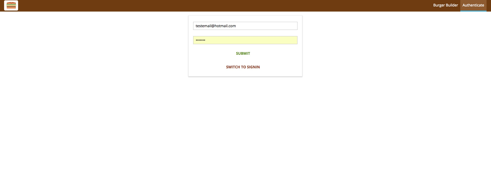
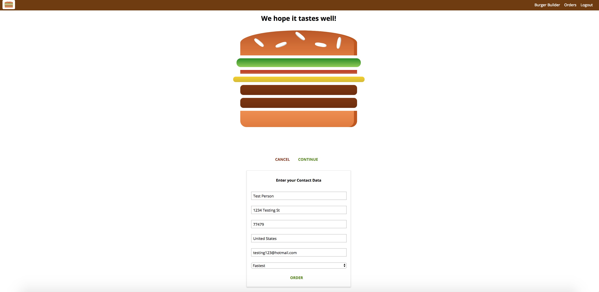
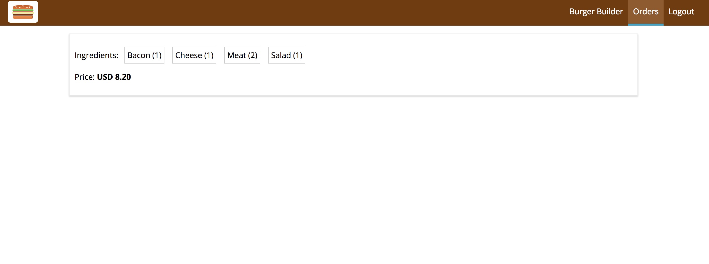

# Burger-builder
Burger-builder is a project using React/Redux with firebase and authentication. It allows users to order a burger, which will show the topics being added visually as well as the current price based on what toppings have been added and a checkout form.

When you first land on the main page, you have the option of customizing a delicious burger and get a visual image of it. However, you must sign up and log in before being able to order the burger. You can sign up by clicking the button "Sign up to order" or by clicking the "Authenticate" button in the top right of the page.

The sign up page is fast and painless, only asking for you to provide an email address and a password (minimum of 6 characters). You can sign up and/or sign in on the same page, simply click the button "Switch to signin" which will then read "Switch to signup".

Once you are logged in, you may now order your burger which takes you to a checkout page. On the checkout page, you need to enter your name, address, email and choose whether you want your order to be prepared the fastest possible, or the cheapest possible.

Finally, once you submit your order, you will be taken back to the main page. You may click on the orders tab in the top right to view your order. Besides that, just wait for us to make and deliver your delicious burger to you!

