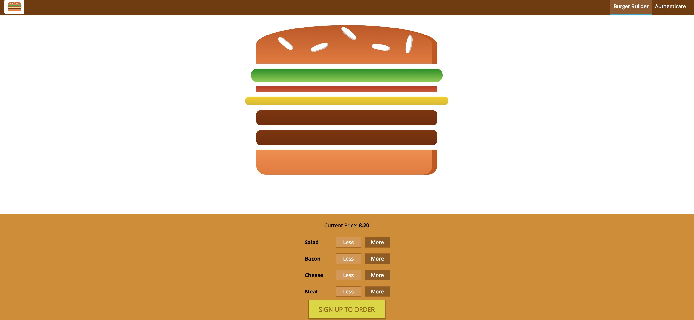

# Burger-builder
Burger-builder is a project using React/Redux with firebase and authentication. It allows users to order a burger, which will show the topics being added visually as well as the current price based on what toppings have been added and a checkout form.

